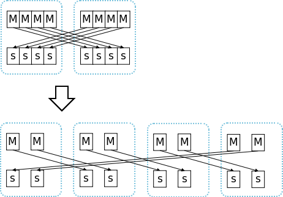
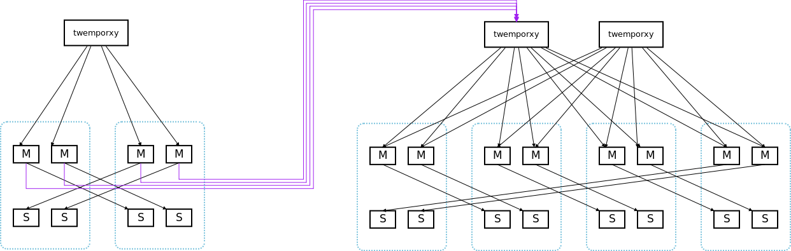
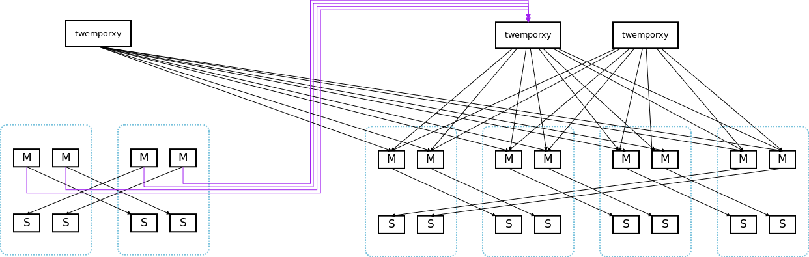

use more shard for scalablity
=============================

If we want to deploy a cluster scalable, we can use more shards(a master and a slave is called a shard)

for example, we have 2 machines, we can use 8 shards. (4 master and 4 slave in each machine), every shard has 5GB memory. (so we use 40GB in eache machine)

when we want a larger cluster with double memory, we add 2 machines, and migrate have of the redis instance to new machines, as following:

ok, now we can scale our cluster from 2 machines to 4 machines,

even more, we can deploy one redis-instance/machine, every redis use 40GB, this cluster can scale to 16 machines, 40G*8=320GB memory.

if we start from 2 machine with 32 shards, we can scale to 32/64 machines.

this is somehow like `redis-cluster <http://redis.io/topics/cluster-spec>`_ , but much easier to manager.

migrate the whole cluster to a new cluster
==========================================

if we have more machines to deploy a new cluster, we can migrate the whole old cluster to new cluster:

as following,

- old cluster: 2 machines with 4 shards,
- new cluster: 4 machines with 8 shards,

we can use `redis-replay <https://github.com/idning/redis/tree/replay>`_ to migrate date (from aof) to new cluster.

we redis-replay is catch up with aof. we can reconfig old twemproxy as a proxy of new cluster.:

all done, we can now stop the old cluster.

